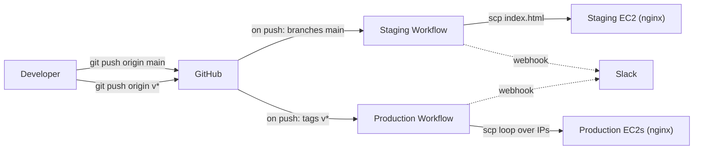

# CI/CD Pipeline — Staging & Production with GitHub Actions

A two-stage deployment pipeline for a static site, with Slack notifications and SSH-based delivery to AWS EC2 instances. Built as a practical exercise for the Techstarter Cloud Engineering course (Kurs 25-06-EON).

## How it works

| Pipeline | Trigger | Target |
|---|---|---|
| **Staging** | Push to `main` | One EC2 (nginx) |
| **Production** | Push of a tag matching `v*` (e.g. `v1.0.0`) | Multiple EC2s (loop over IPs) |



Each run posts a *started* message to Slack, then a *success* or *failure* message at the end (`if: ${{ success() }}` / `if: ${{ failure() }}`).

## Stack

- **CI/CD:** GitHub Actions
- **Deployment:** SSH + `scp` to AWS EC2 (Ubuntu 24.04 LTS, nginx)
- **Notifications:** Slack incoming webhook
- **Frontend:** plain HTML — placeholder for the deploy mechanism, not the focus

## Repository layout

```
.
├── frontend/
│   └── index.html
└── .github/
    └── workflows/
        ├── staging.yml      # push to main  → deploy to staging
        └── production.yml   # tag v*        → deploy to production
```

## Replicating this

### Required GitHub Secrets

*Settings → Secrets and variables → Actions:*

| Secret | Format |
|---|---|
| `SSH_PRIVATE_KEY` | Full private key incl. `-----BEGIN…-----` / `-----END…-----` lines |
| `EC2_IP_STAGING` | Single IP, e.g. `1.2.3.4` |
| `EC2_IPS_PROD` | Space-separated IPs, e.g. `1.2.3.4 5.6.7.8` |
| `SLACK_WEBHOOK_URL` | Slack incoming webhook URL |

### EC2 prep

On every target instance:

```bash
sudo apt update && sudo apt install -y nginx
sudo chown -R ubuntu:ubuntu /var/www/html   # so scp works without sudo
```

### Releasing

```bash
# Deploy current main to staging
git push origin main

# Promote to production
git tag -a v1.2.0 -m "Release 1.2.0"
git push origin v1.2.0
```

## Notes

- **Loop deploys are not rolling.** If `prod-1` succeeds and `prod-2` fails, the job is marked failed but `prod-1` is already updated. Good enough for a coursework lab; a real setup would add health checks and rollback.
- **Public IPs change on stop/start.** For stable targets, attach Elastic IPs.
- **Host keys are pinned per run** via `ssh-keyscan` instead of disabling `StrictHostKeyChecking` — small thing, but the better habit.
